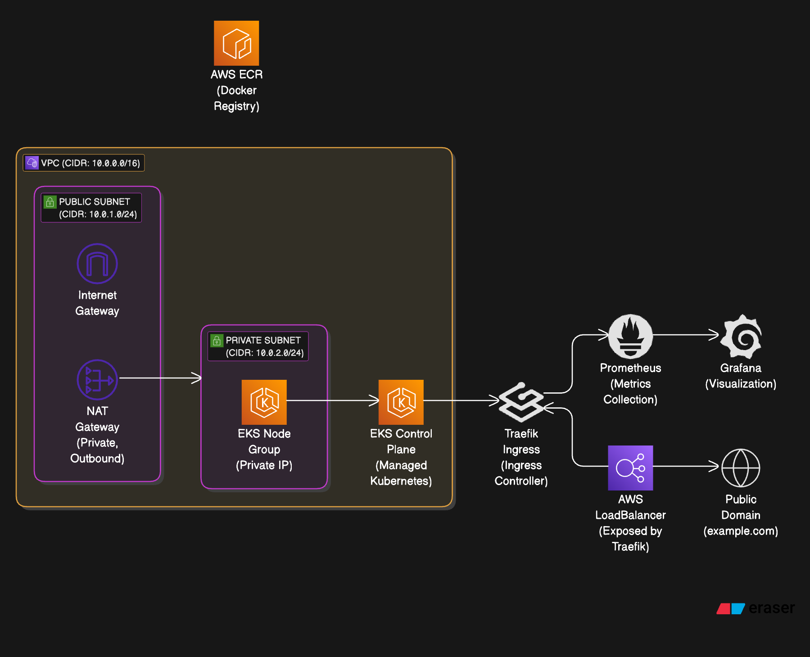

## **Documentation: EKS Infrastructure Setup**

This document outlines the **infrastructure setup** for deploying applications on **AWS EKS (Elastic Kubernetes Service)** using **GitHub Actions**, **Terraform**, **Traefik**, **ECR (Elastic Container Registry)**, **Grafana**, and **Prometheus**. The setup includes automated deployment pipelines, monitoring solutions, and traffic routing to various services.

---

### **Architecture Overview**

The architecture consists of the following components:

1. **AWS EKS**: Manages and orchestrates Kubernetes clusters in AWS.
2. **GitHub Actions**: Automates CI/CD pipelines to build, test, and deploy code to EKS.
3. **Terraform**: Manages infrastructure resources like VPC, subnets, security groups, EKS clusters, and other AWS resources.
4. **Traefik**: Acts as an Ingress Controller and routes external traffic to Kubernetes services, handling SSL/TLS termination via Let’s Encrypt.
5. **ECR (Elastic Container Registry)**: Stores Docker images for applications, services, and monitoring tools (Grafana, Prometheus).
6. **Grafana**: Visualizes application metrics and infrastructure health collected by Prometheus.
7. **Prometheus**: Collects and stores metrics from Kubernetes, applications, and infrastructure components.

---

### **Infrastructure Flow**

1. **Terraform** provisions the AWS infrastructure:
   - A **VPC** with public and private subnets.
   - **EKS Cluster** for orchestrating Kubernetes workloads.
   - **ECR** repositories for storing Docker images.
   - **IAM roles and security groups** for proper access management.

2. **GitHub Actions** automates the CI/CD pipeline:
   - Builds and pushes Docker images to **ECR**.
   - Deploys applications and services to **EKS** using **kubectl** and **Helm**.
   - Applies the necessary **Kubernetes manifests** (for services, Traefik, Prometheus, and Grafana) to the **EKS cluster**.

3. **Traefik**:
   - Acts as the **Ingress Controller** in Kubernetes.
   - Routes HTTP/HTTPS traffic from the **internet** to Kubernetes services (API, Grafana, Prometheus).
   - Automatically provisions SSL certificates using **Let's Encrypt** for secure communication.

4. **Prometheus** collects metrics from Kubernetes nodes, pods, and services.

5. **Grafana** connects to **Prometheus** as a data source to display visual dashboards for monitoring.

---

### **Detailed Steps for Setup**

#### **1. AWS EKS Setup Using Terraform**
1. **Create VPC**:
   - Use Terraform to create a **VPC**, public and private subnets, and security groups to secure traffic.
   - Configure the **Internet Gateway** and **NAT Gateway** for internet access.

2. **Create EKS Cluster**:
   - Use Terraform to provision an **EKS cluster** in the created VPC. This includes configuring worker nodes, IAM roles, and security groups.

3. **IAM Roles**:
   - Use **Terraform** to create **IAM roles** for EKS and worker nodes to interact with AWS services (like **ECR**, **CloudWatch**, etc.).

4. **ECR Setup**:
   - Create **ECR repositories** using Terraform for storing Docker images.

#### **2. CI/CD with GitHub Actions**
1. **GitHub Actions Pipeline**:
   - Use **GitHub Actions** to automate the CI/CD pipeline. This includes:
     - **Build**: Build Docker images for the application and monitoring tools (Grafana, Prometheus).
     - **Push**: Push images to **ECR**.
     - **Deploy**: Deploy the images to the **EKS cluster** using `kubectl` or **Helm**.

2. **CI/CD Workflow**:
   - On every code push to the `main` branch, the workflow triggers:
     - Build and push Docker images to **ECR**.
     - Deploy the new image to **EKS**.

#### **3. Traefik Setup**
1. **Traefik as Ingress Controller**:
   - Deploy **Traefik** on **EKS** using **Helm** or Kubernetes manifests.
   - Configure **Traefik** to route traffic from external requests to internal services like **Grafana**, **Prometheus**, and **API**.

2. **SSL with Let’s Encrypt**:
   - Configure **Traefik** to use **Let's Encrypt** for automatic SSL/TLS certificate provisioning.
   - Traefik will automatically manage the certificates for your domains.

#### **4. Grafana and Prometheus Setup**
1. **Install Prometheus**:
   - Deploy **Prometheus** using the **Helm chart** or **Kubernetes manifests** to collect metrics from Kubernetes and services.

2. **Install Grafana**:
   - Deploy **Grafana** using **Helm** or **Kubernetes manifests**.
   - Configure **Grafana** to pull data from **Prometheus** for visualization.

3. **Prometheus Scraping**:
   - Set up **Prometheus scraping** configurations for Kubernetes metrics (nodes, pods) and application-specific metrics.

4. **Create Grafana Dashboards**:
   - Import pre-configured **Grafana dashboards** to visualize Kubernetes and application metrics.

#### **5. EKS Access and Domain Management**
1. **DNS Configuration**:
   - Configure **Route 53** to link the **domain name** to the **Traefik LoadBalancer** using an **A record** or **CNAME**.
   - **Namecheap** or **Route 53** DNS management can be used to link the domain name (e.g., `api.iamclouddevops.xyz`, `grafana.iamclouddevops.com`, `prometheus.iamclouddevops.com`) to the Traefik LoadBalancer’s DNS.

---

### **Diagram: EKS Infrastructure Setup**

Here is a simple diagram that illustrates the setup:

```plaintext
                   +---------------------------+
                   |      AWS EKS Cluster      |
                   |  (Managed Kubernetes)      |
                   +---------------------------+
                               |
           +--------------------------------------------+
           |                                            |
+-------------------+                            +-------------------+
|     Traefik       |<---> Ingress Routes <-->   |   API Service     |
|  (Ingress Controller)                        |  (Application API)|
|  SSL via Let's Encrypt                       +-------------------+
+-------------------+                                |
           |                                          |
           |                                          |
+-------------------+                          +-------------------+
|   Grafana Service |                          | Prometheus Service|
|  (Visualization)  |                          | (Metrics collection)|
+-------------------+                          +-------------------+
           |
           |
+-------------------+
|  AWS LoadBalancer |
|  (Exposed by Traefik) |
+-------------------+
           |
  +-------------------+  
  |    Domain Name    |  <---  Route 53 / Namecheap DNS (e.g., api.example.com)
  |    (Route 53)     |
  +-------------------+  
```
More detailed Diagram setup:




### **Description of the Diagram**:

1. **AWS EKS Cluster**: The main Kubernetes cluster where all applications, services, and monitoring tools run.
2. **Traefik**: The **Ingress Controller** routes external traffic to the appropriate services based on domain names and paths (e.g., `/api`, `/grafana`, `/prometheus`).
3. **API Service**: An example service within the Kubernetes cluster that receives traffic routed by Traefik.
4. **Grafana & Prometheus**: Both monitoring tools are deployed on the Kubernetes cluster. Grafana fetches data from Prometheus for visualization.
5. **AWS LoadBalancer**: Exposes **Traefik** externally and serves as the entry point for all incoming traffic.
6. **Domain Name**: Configured via **Route 53** or **Namecheap** to route traffic to the **Traefik LoadBalancer**.

### **Conclusion**

This infrastructure setup provides:

- **Automated CI/CD** through **GitHub Actions** for building, pushing, and deploying Docker images.
- **EKS** for managing Kubernetes clusters with **Traefik** as the **Ingress controller** to route traffic.
- **SSL** via **Let’s Encrypt** using **Traefik** for secure connections.
- **Prometheus** and **Grafana** for monitoring Kubernetes clusters and applications.

With this setup, your applications are automatically deployed and secured with SSL, while providing easy access to monitoring dashboards for visualizing metrics.This setup is highly scalable and maintainable, making it suitable for complex applications and large-scale deployments.


